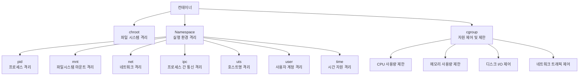

## 컨테이너 구조
컨테이너는 리눅스의 핵심 기능(chroot, namespace, cgroup)을 기반으로 동작한다.

#### 구성 요소 관계도


### 1. chroot (change root)
- 개념
  - 파일시스템 격리 기술
  - 특정 디렉토리를 루트(/) 디렉토리로 지정해, 그 경로 바깥의 파일은 접근할 수 없도록 제한
  - 일종의 "가짜 루트(root jail)" 환경을 만들어 보안과 격리성 확보

- 특징
  - 상위 디렉토리 접근 불가 (.. 사용해도 실제 루트로 나갈 수 없음)
  - 완전한 컨테이너 기술은 아니고, 기본적인 격리 수준만 제공
  - ldd 명령으로 실행 파일이 의존하는 라이브러리를 복사해야 정상 동작

- 활용
  - 구형 유닉스 환경에서 FTP 서버, 웹 서버, DNS 서비스 보안을 위해 사용
  - 취약점 발생 시, 공격자가 시스템 전체가 아닌 제한된 디렉토리 안에서만 활동 가능

- 실습 예시
```
# 루트 권한 전환
sudo -i

# 작 디렉토리 생성
mkdir appdir
mkdir appdir/{bin,lib64}

# bash 실행 파일 및 라이브러리 복사
cp /bin/bash appdir/bin/
cp /lib64/libtinfo.so.6 appdir/lib64/
cp /lib64/libc.so.6 /lib64/ld-linux-x86-64.so.2 appdir/lib64/

# chroot 실행
sudo chroot appdir /bin/bash

# 디렉토리 구조 확인
tree appdir/
```

### 2. Namespace
- 개념
  - 리눅스 커널 기능으로, 자원을 논리적으로 분리해 독립된 실행 공간 제공
  - 컨테이너는 각 프로세스가 별도의 공간에서 실행되는 것처럼 동작

- 대표적인 Namespace 종류

| Namespace                             | 설명                                                                        | 예시                                                              |
| ------------------------------------- | ------------------------------------------------------------------------- | --------------------------------------------------------------- |
| **pid** (Process ID)                  | 프로세스 번호를 분리하여 컨테이너 내부에서는 독립된 PID 공간을 가짐. 각 컨테이너는 자신의 PID `1` 프로세스를 갖고 있음. | 컨테이너 내부에서 `ps -ef` 실행 시, 호스트의 다른 프로세스는 보이지 않음                   |
| **mnt** (Mount)                       | 파일시스템 마운트 포인트를 분리. 각 컨테이너는 독립된 루트 파일시스템을 갖는 것처럼 동작.                       | 특정 컨테이너 안에서 `/mnt`에 마운트한 디스크는 다른 컨테이너와 공유되지 않음                  |
| **net** (Network)                     | 네트워크 인터페이스, IP, 라우팅 테이블 등을 분리. 각 컨테이너는 고유한 가상 네트워크 환경을 가짐.                | 컨테이너마다 `eth0` 인터페이스가 생성되고 독립적인 IP 할당                            |
| **ipc** (Inter-Process Communication) | 프로세스 간 공유 메모리, 세마포어, 메시지 큐를 격리. 컨테이너끼리 IPC 자원을 공유하지 않음.                   | 컨테이너 A에서 생성한 공유 메모리를 컨테이너 B는 접근 불가                              |
| **uts** (UNIX Time-Sharing System)    | 호스트명(hostname)과 도메인명을 격리. 컨테이너마다 다른 시스템 이름을 가질 수 있음.                      | `docker run --hostname test01` 실행 시, 컨테이너 내부 hostname은 `test01` |
| **user**                              | 사용자와 그룹 ID를 분리. 컨테이너 내부의 root 사용자가 호스트에서는 일반 사용자로 매핑될 수 있음.               | root 권한을 분리해 보안 강화                                              |
| **cgroup** (Control Group)            | 프로세스가 사용하는 CPU, 메모리 등 자원을 제한하고 할당. Namespace와 함께 사용됨.                     | 컨테이너별 메모리 사용량 제한 (`--memory` 옵션)                                |
| **time** (Linux 5.6+)                 | 시간 관련 자원을 분리. 컨테이너마다 시스템 클럭을 다르게 유지 가능.                                   | 특정 컨테이너 시간을 테스트 목적으로 조정 가능                                      |

- 실습 예시
```
# 특정 프로세스가 사용하는 Namespace 확인
cd /proc/<PID>/ns
ls -l
```
- 출력 예시
```
cgroup -> cgroup:[4026531835]
ipc    -> ipc:[4026531839]
mnt    -> mnt:[4026531840]
net    -> net:[4026531956]
pid    -> pid:[4026531836]
user   -> user:[4026531837]
uts    -> uts:[4026531838]
```

### 3. cgroup (Control Groups)
- 개념
  - 프로세스 단위 자원 제어 기술
  - CPU, 메모리, 네트워크, 블록 I/O 등 시스템 자원 사용량을 제한, 할당, 모니터링 가능
  - 컨테이너 환경에서 리소스 분리와 효율적인 자원 관리를 위해 반드시 사용됨

- 특징
  - 프로세스를 그룹 단위로 관리 → "컨트롤 그룹"
  - 각 그룹에 CPU 시간, 메모리 용량, I/O 대역폭 등을 할당 가능
  - Namespace가 "격리"라면, cgroup은 "제한 및 제어"

- 주요 자원 제어 항목

| cgroup 서브시스템            | 설명                               |
| ----------------------- | -------------------------------- |
| **cpu / cpuacct**       | CPU 사용량 제한, 사용 통계 제공             |
| **memory**              | 메모리 사용 제한, OOM(Out-Of-Memory) 제어 |
| **blkio**               | 디스크 입출력 속도 제어                    |
| **net\_cls, net\_prio** | 네트워크 트래픽 관리                      |
| **devices**             | 특정 장치 접근 권한 제어                   |
| **pids**                | 생성할 수 있는 프로세스 수 제한               |

- 실습 예시
```
# cgroup 디렉토리 구조 확인
cd /sys/fs/cgroup/
ls

# 메모리 cgroup 확인
cd memory/
ls

# 새로운 cgroup 생성
sudo mkdir /sys/fs/cgroup/memory/process1

# 메모리 제한 설정 (100MB)
echo 104857600 > /sys/fs/cgroup/memory/process1/memory.limit_in_bytes

# 프로세스를 해당 그룹에 할당
echo <PID> > /sys/fs/cgroup/memory/process1/cgroup.procs
```

- Docker와의 관계
  - `docker run --memory=512m --cpus=1` → 컨테이너 내부에서 cgroup 설정을 통해 CPU 1개, 메모리 512MB로 제한
  - Namespace로 "논리적 격리", cgroup으로 "물리적 제한"을 동시에 제공
  
